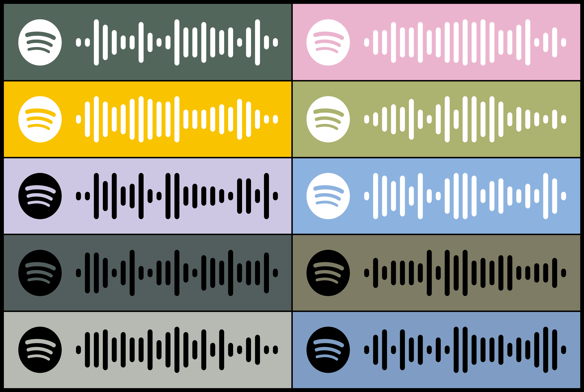
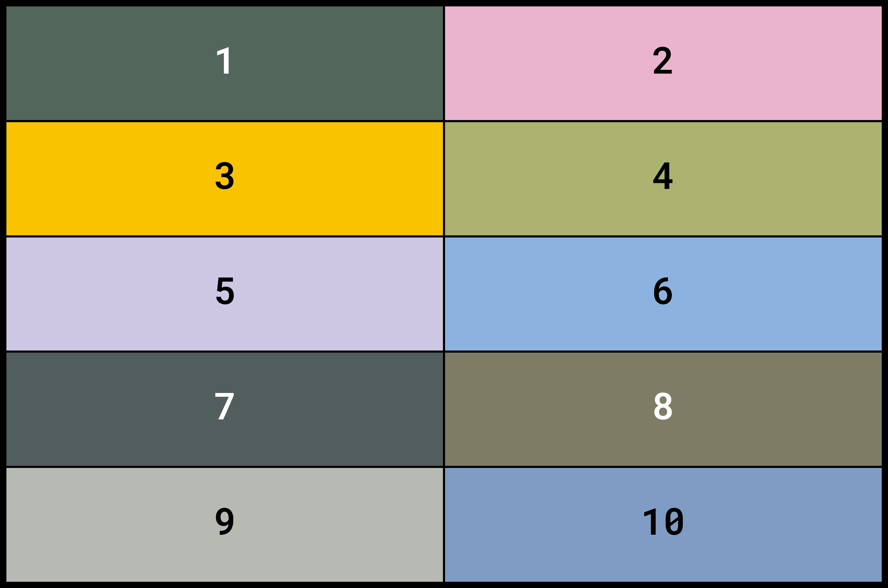

## spotify top 500 game




In this repository is some code that is used to generate some cards for a game I made up[^1].

> [!IMPORTANT]  
> The only DIY part is not the code here. You also need quite a bit of crafting, so beware 😉

### game rules

The game is quite simple. You need two teams[^2] and the deck of cards that you'll generate here. The cards will have QR codes on one side, which will start playing the most popular song of a given artist when scanned. On the other side is the Spotify popularity ranking of that artist. The QR codes should be facing up in the deck.

When it's your turn, you pick a card from the deck and scan the QR code. In the first turn, you can try to guess how high this artist ranks, but it doesn't matter. You flip your card and put it in front of you. The other team does the same. They pick a card, listen to the song, and put the card down.

When it's your turn again, you pick a new card from the deck and listen to the song. This time, before looking at the number on the back, you need to guess whether this is a more or less popular artist than the number in front of you. You place the new card accordingly and flip it. If it's correct, you get to leave the card there. Otherwise you need to toss it. Either way, it's the other team's turn.

The game keeps going like this, and the goal is to be the first team to make a correct "popularity line" first. I thought 10 is a good final number, but see for yourself.

When you play the songs, you are allowed to see the artist's and the song's name, but obviously don't look at their rank.

_P.S._: Obviously this is just meant for personal use as the game involves a lot of copyrighted content :)

_P.P.S_: Obviously, the rankings change on a daily basis, and the rankings you get today will be wildly different from what you will get in some years. Perhaps this is a drawback, but it can also be nostalgic. If you play the game you printed today in five years, it adds another cool dimension.

### generating the game

The first part involves scraping some rankings, generating qr codes from the rankings and combining them into a printable format. This part is all handled in this repository.

First install the dependencies.

```bash
pip install -r requirements.txt
```

Then you need to run `scrape_top_songs.ipynb`, `generate_qr_codes.ipynb` and `make_tr_tiles.ipynb`, and you need to run them in that order. Some example outputs are shown at the top of the readme. The notebooks are decently documented, so if you want to change anything around, it should be easy. I use the colours defined in `colours.json` in the qr codes, which are taken from [here](https://github.com/sarraahr/limonata-colors). You want to print the images that are generated in the `grids` folder. If you print them directly on 10cm by 15cm paper, it works quite well.

### manual craft

Once you have your prints, you need to cut each tile and stick the corresponding qr and number pairs against each other. I just cut them using a pair of scissors and patched them together using photograph tape. It was quite tedious, and I'm sure there must be a smarter way to do this 😅

[^1]: "a game I made up" is maybe too strong. There is this game called hitster where you try to rank cards based on when the songs were released, which is what gave me this idea. There was also a similar history game I once played, but I haven't found it since.
[^2]: Teams of one work too :D
